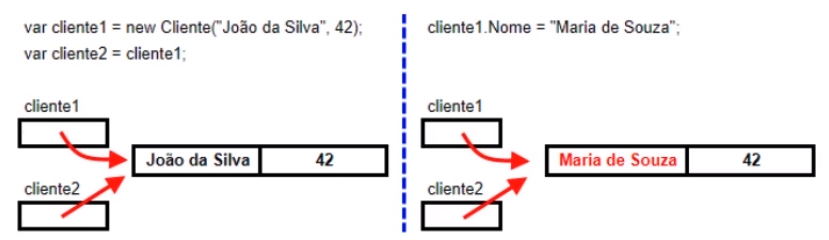

# Alura: Curso de Certificação C# Programming 70-483 - Parte 1

Chegamos ao final de mais um curso da Alura, o curso de Certificação do exame 70-483 Programming in C#" Parte 1.

## Aula 1: Criar tipos de valor

Revisaremos rapidamente o conteúdo aprendido durante nossas aulas. Por exemplo, como criar os Tipos de Valor. Aprendemos quais são os Tipos Inteiros utilizados na linguagem C#, que vão desde o tipo byte até o tipo long.

Vimos como trabalhar com o tipo de Ponto Flutuante, que permite armazenar valores com casas decimais. Depois, fomos apresentados ao tipo Decimal, uma categoria de tipo de ponto flutuante, mas com uma representação decimal e não binária dos valores com casas decimais, o que muito mais adequado para o armazenamento de valores financeiros.

Na sequência, entendemos como trabalhar com Booleanos, um tipo essencial para fazer um fluxo de uma aplicação com instruções como o if e o swift.

Também trabalhamos com as estruturas definidas pelo usuário, os chamados Structs, e as enumerações ou Enums, agrupamentos de constantes que fazem parte de uma mesma lógica.

## Aula 2: Criar tipos de referência

Depois aprendemos a criar Tipos de Referência. Começamos pelas Classes, blocos que fazem acontecer toda a programação orientada a objetos na linguagem C#, e as Interfaces, maneiras de abstrair características comuns entre as classes, os métodos e as propriedades.

Vimos também como usar os Delegates, que são representações de métodos que podem ser armazenados em variáveis. Os Objetos, por sua vez, são as instâncias concretas de uma classe que são armazenadas em memória.

Entendemos como trabalhar com os tipos dinâmicos ou Dynamics, uma forma de fazer a verificação da chamada de um método ou de uma propriedade somente em tempo de execução, mas não de compilação.

Aprendemos a trabalhar com Strings que são um tipo de referência que nos permite trabalhar de várias formas com cadeias de caracteres.

## Aula 3: Métodos, parâmetros, métodos de extenção

Usando os métodos, entendemos que os Parâmetros Opcionais possibilitam fazer uma chamada para acionar um método sem precisar adicionar todos os parâmetros sempre. Os parâmetros opcionais assumem valores-padrão para essa chamada.

Os Métodos de Extensão permitem que adicionemos métodos a uma classe sem precisar modificar a classe original, apenas estendendo-os separadamente em uma classe estática.

Com as Propriedades Indexadas, acionamos determinadas informações de uma classe através de um índice, o que faz parecer que estamos lidando com uma coleção ou um array.

## Aula 3: Métodos sobrecarregados e substituidos

Aprendemos sobre os Métodos Sobrecarregados, que possuem um mesmo nome, mas listas de parâmetros diferentes. Podemos ter parâmetros a mais ou a menos, e variar os tipos, fazendo o que chamamos de overload de métodos.

Por fim, vimos como utilizar os Métodos Substituídos, que são provenientes da classe-base e podem ser trocados por uma outra versão de método nas classes derivadas.

Espero que tenham gostado do curso. Obrigada e até a próxima!

