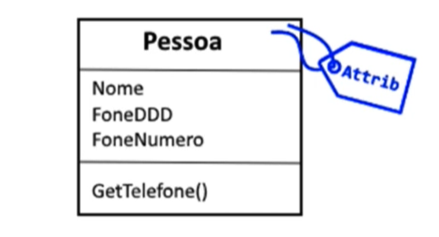

# Alura: Curso de Certificação C# Programming 70-483 - Parte 10

Chegamos ao final da parte 10 do nosso curso de <b>certificação 70-483 Programação em C-Sharp</b>. Vamos, então, fazer uma revisão bem rápida das coisas que a gente aprendeu aqui.

## Criar e aplicar atributos

Nós começamos a ver sobre a criação e aplicação de atributos. Então, nós vimos que os atributos eles são metadados, eles são informações sobre informações, eles são dados sobre dados, que podem ser acrescentados a tipos, como, por exemplo, uma classe ou então a um membro da classe, como um campo ou uma propriedade ou um método.

Então, a gente aprendeu sobre isso aqui no código, quando o nosso trabalhamos com a classe venda. A classe venda ela possui alguns atributos, que são, por exemplo, o Serializable, que é um atributo de classe, e aqui embaixo o NonSerialized, que é um atributo de campo. Nós aprendemos a utilizar esses dois atributos, que já vêm imbutidos no .NET.

E aprendemos também a criar atributos novos, declarando duas classes novas, que são o formato resumido e o formato detalhado. Nós aprendemos que esses atributos customizados eles precisam ser declarados aqui como classes, como é o caso de FormatoResumidoAttribute, e esse tipo de classe precisa herdar da classe base atributo.

Aprendemos, também, que esse tipo de atributo ele precisa ter um formato ou um modo de utilização. No nosso caso, nossos atributos eles são decorados com outro atributo, chamado de AttributeUsage ou utilização do atributo que foi definido com um target, ou um alvo, que é a classe. Ou seja, nós limitamos o uso dele somente a classes. E nós definimos, também, que esse tipo de atributo só pode ser utilizado uma vez, marcando o AllowMultiple como falso.

## Ler atributos

E nós vimos, também, como ler atributos. Nós aprendemos a ler os atributos, como, por exemplo, o atributo que foi adicionado à classe de venda, nós fizemos essa leitura aqui no Item2. Então, no Item2 - Ler os atributos, nós abrimos a classe relatório e lá dentro, no momento de fazer a impressão, nós decidimos qual o formato de impressão utilizar através da declaração de uma variável atributo.

Essa variável atributo vai pegar lá dentro do atributo da classe de venda através do método GetCustomAttribute, passando o tipo da classe venda e também o tipo da classe que compõe o atributo. E, no final, nós pegamos a informação desse atributo, acessando a propriedade formato do formato detalhado.

## Usar reflection

Nós vimos também, em seguida, como utilizar reflection, que é uma maneira de fazer o código olhar para dentro de si mesmo ou investigar outras classes e outros tipos. Nós vimos, por exemplo, aqui no Item03 (Item03 - Usar reflection). Nós aprendemos aqui na classe programa que é possível em várias tarefas utilizar o reflection para, por exemplo, obter o tipo de um relatório, de uma determinada classe, obter quais são os membros de um relatório, onde os membros são, por exemplo, campo, método e propriedades.

Aprendemos a modificar o nome de um objeto do nosso relatório via reflection, que pode ser uma maneira alternativa de modificar uma propriedade. Nós aprendemos, também, a descobrir quais são os tipos que fazem parte de um assembly. E aprendemos também a utilizar o LINQ, que são as consultas integradas a linguagem para poder varrer os tipos de um assembly, para poder fazer uma consulta mais enxuta, mais elegante para poder utilizar reflection.

## Gerar código em tempo e execução

  

  
E, continuando, nós fomos lá para o Item04, que é gerar o código em tempo de execução. Então, nós aprendemos a fazer um programinha aqui no Item04 geração de código. E esse programa cria aqui um namespace chamado recursos humanos e lá dentro ele declara uma classe funcionário com alguns campos, nome e salário, e também o construtor. Então nós utilizamos aqui através da geração de código, chamado CodeDOM, ou objetos do modelo de código do dot net, para a gente poder declarar vários tipos de objetos, para poder montar cada parte desse código aqui, o código do namespace recursos humanos.

## Usar tipos do namespace System.Reflection

E lá no final, na última parte, a gente aprendeu a utilizar os tipos do namespace System.Reflection. Então, nós já tínhamos visto algumas coisas sobre o reflection. E aprendemos a nos aprofundar nesse nesse tema.

Aqui no Item05 nós aprendemos a criar um programa que faz uma série de investigações, como, por exemplo, obter qual é a versão do assembly, qual é a versão maior, a versão menor, para descobrir também se um determinado assembly está ou não no cache de assembly global, para descobrir os objetos, que são os módulos, os tipos e, também, os membros desses objetos que estão no assembly.

Então é isso, espero que vocês tenham gostado do curso. Não deixem de participar do fórum, em caso de sugestões ou dúvidas. Muito obrigado e até a próxima.

