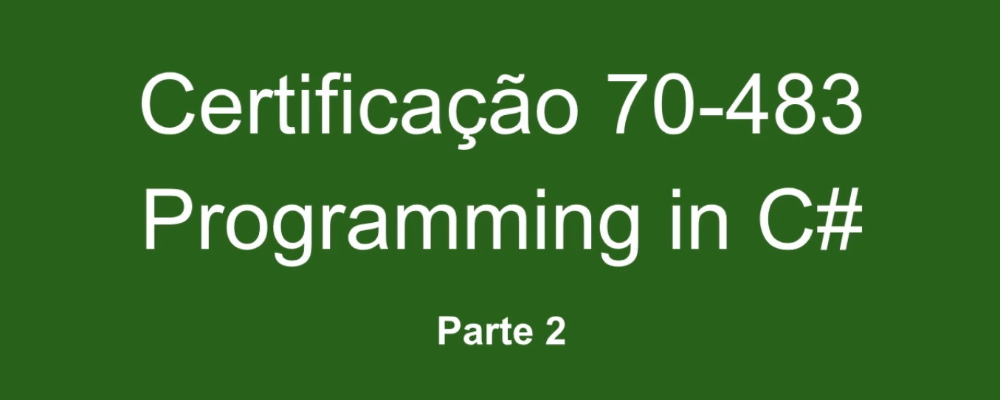

# Alura: Curso de Certificação C# Programming 70-483 - Parte 2

Chegamos ao final do curso <b>Certificação 70-483 Programando em C# <i>Parte 2</i></b>. Faremos uma breve revisão dos conteúdos que aprendemos até aqui.

## Aula 1: Boxing e unboxing

Vimos, por exemplo, o Boxing e o Unboxing, que se tratam da conversão entre objetos e valores primitivos, como pegar um número inteiro e convertê-lo num tipo object, ou o caminho oposto, pegar um objeto e extrair dele um valor primitivo, como um inteiro.

## Aula 2: Cast de tipos

Depois disso vimos como fazer as conversões implícitas, feitas automaticamente quando armazenamos o valor de um tipo dentro da variável de um tipo que comporta um valor maior. Essas conversões são feitas automaticamente por serem efetuadas de forma segura.

Outra forma de fazer uma conversão são as conversões explícitas, quando as conversões não podem ser feitas automaticamente. Por exemplo, quando não podemos armazenar numa variável o valor contido numa outra variável que suporta um valor maior. Para conseguir fazer essa conversão, aprendemos a utilizar a técnica chamada de cast.

Também aprendemos a converter explicitamente de forma segura utilizando o operador AS e com o IS, que permite verificar qual é o tipo de um objeto. Assim conseguimos saber se ele é de uma determinada classe ou interface.

## Aula 3: Implementando conversões

Na sequência, vimos como trabalhar com conversões definidas pelo usuário por meio da palavra operator, e como fazer conversões com classes auxiliares, assim como converter um valor armazenado numa string em um valor inteiro decimal utilizando os métodos Parse() e TryParse().

## Aula 4: Lidar com tipos dinâmicos

Aprendemos a lidar com os tipos dinâmicos, e para isso vimos os diferentes tipos de declarações de variáveis, string, var, object e dynamic. Então, fizemos conversões entre dynamic e outros tipos e como trabalhar com resolução de sobrecarga para evitar conflitos entre métodos declarados com o tipo dynamic e como object.

## Aula 5: Adicionando membros dinamicamente

Mais para o fim do curso, vimos como adicionar membros dinamicamente utilizando instâncias da classe ExpandoObject(). Finalmente, trabalhamos com componentes que foram criados com a tecnologia COM, caso das aplicações que fazem parte do pacote Office. Conseguimos acessar os objetos feitos com a tecnologia COM através da Interoperabilidade acessando esses métodos com variáveis dinâmicas.

Espero que tenha gostado desse curso. Participe do fórum. Obrigado e até a próxima!

